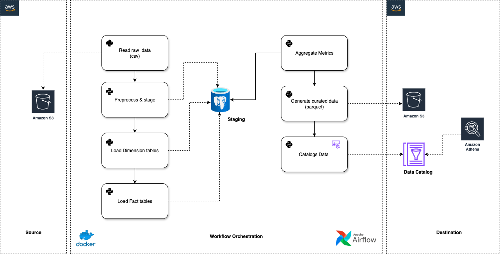

# 🛍️ Retail E-commerce Analytics Pipeline  
**Apache Airflow 3.0 + PostgreSQL + AWS (S3, Glue)**

This project builds a robust end-to-end data pipeline for processing and analyzing e-commerce events. Built using modern Data Engineering best practices with Airflow assets, incremental processing, PostgreSQL, and AWS integration.

---

## 📁 Folder Structure

```

.
├── aws\_resources/          # CDK-generated AWS infrastructure (S3, Glue Crawler)
├── dags/
│   ├── retail\_pipeline\_assets.py   # Airflow DAG for staging → fact/dim
│   └── retail\_pipeline.py          # Airflow DAG for aggregates + Glue Crawler
├── scripts/
│   └── table\_creation.sql  # PostgreSQL DDL for staging + mart schema
├── architecture/
│   └── Airflow-Retail-ETL.drawio.png  # Architecture diagram
├── docker-compose.yaml     # Local Airflow deployment
└── .venv/                  # Python virtual environment (excluded from git)

````

---

## ⚙️ Tech Stack

| Component              | Purpose                                     |
|------------------------|---------------------------------------------|
| Apache Airflow 3.0     | Orchestration using asset-based DAGs       |
| PostgreSQL             | Staging and dimensional modeling            |
| AWS S3                 | Raw and aggregated data storage             |
| AWS Glue Crawler       | Schema registry for Parquet marts           |
| Docker Compose         | Local Airflow setup                         |
| DuckDB + Pandas        | Optional in-memory data transformations     |

---

## 📌 Pipeline Overview

### 🔹 DAG 1: `retail_pipeline_assets.py`

- Reads daily raw event CSVs from `s3://airflow-retail-stage/`
- Loads into:
  - `staging_events`
  - Dimension tables: `dim_product`, `dim_user`, etc.
  - Fact table: `fact_events`
- All loads are incremental using execution date.

### 🔹 DAG 2: `retail_pipeline.py`

- Computes daily KPIs:
  - Total revenue
  - Active users
  - Funnel conversion
- Stores aggregates in Parquet under `s3://airflow-retail-mart/aggregates/...`
- Triggers Glue Crawler to update the AWS Glue Data Catalog

---

## 🖼️ Architecture Diagram



---

## 📊 Key Business Metrics

- 🛒 Total daily revenue
- 👤 Daily active users
- 🔄 Funnel: Views → Carts → Purchases
- 🏆 Top brands and categories

---

## 🚀 Quick Start (Local)

```bash
# 1. Clone repo
git clone https://github.com/yourusername/retail-pipeline.git
cd retail-pipeline

# 2. Start Airflow locally
docker-compose up --build

# 3. Open Airflow UI
# http://localhost:8080

# 4. Create tables (in PostgreSQL)
psql -h localhost -U airflow -d airflow -f scripts/table_creation.sql
````

---

## 📦 S3 Structure

* **Raw data**
  `s3://airflow-retail-stage/month/YYYY-MM-DD/event.csv`

* **Aggregated output**
  `s3://airflow-retail-mart/aggregates/<metric>/dt=YYYY-MM-DD/...`

---

## 🔄 AWS Integration

* Airflow connects to AWS via the `aws` connection.
* CDK script under `aws_resources/` provisions:

  * S3 buckets
  * Glue Crawler
* Crawler is triggered in the `retail_pipeline` DAG

---

## ✅ To-Do

* [ ] Add tests and CI workflow
* [ ] Add Athena queries over the parquet data
* [ ] Add Great Expectations or Data Quality checks
* [ ] Add Redshift Spectrum integration

---

## 🪪 License

Licensed under the [MIT License](LICENSE).
